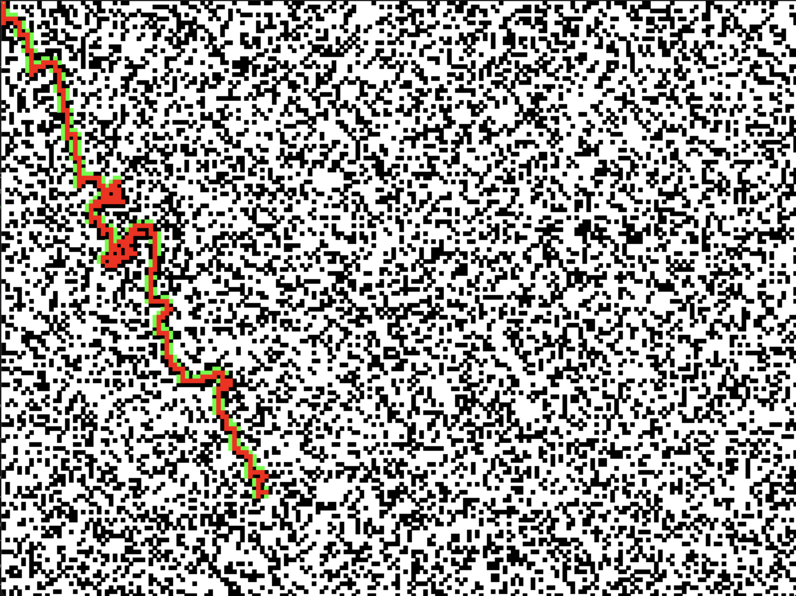
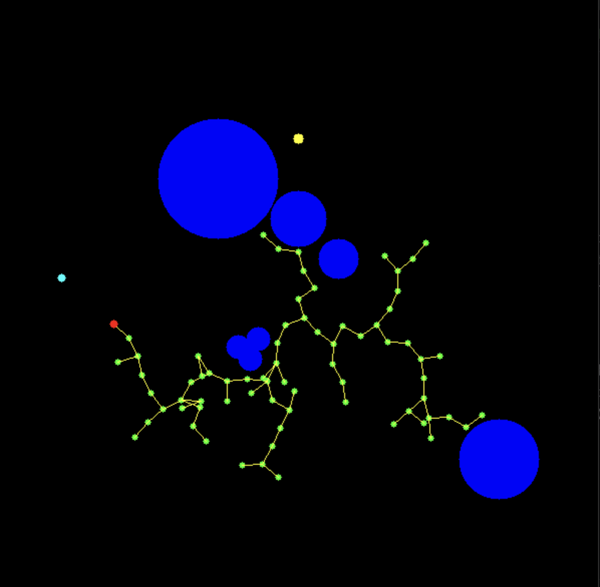

Foundational algorithms in cpp - **basic edition**
==================================================


Recently I have messed with some very basic algorithms in C++:
- A*
- RRT
- neural nets

I made a bunch of implementations.
I wouldn't claim that code is pretty, but at least it's short and visualizations are pretty!

Check out A star:



Check out RRT:




I will add visualization for neural net soon [TM].


How to run
----------

Install dependencies.
```
brew install cmake eigen opencv@3
```

Build the project

```
mkdir build
cd build
cmake ..
make
```

It's almost guaranteed something won't work with the above instruction.
That's cpp, what were you thinking?!


